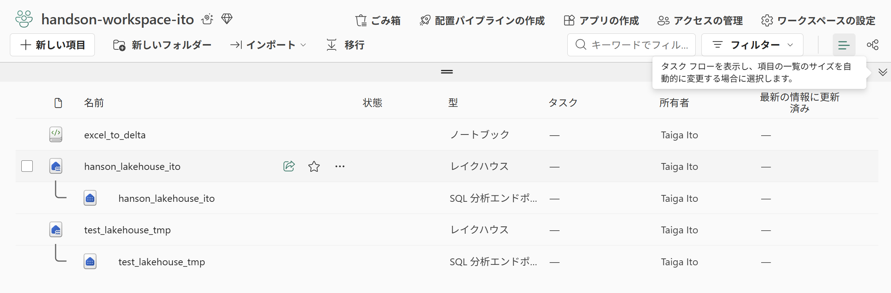
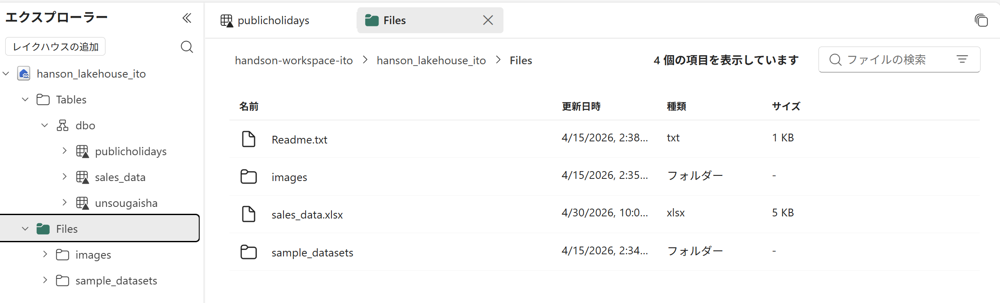
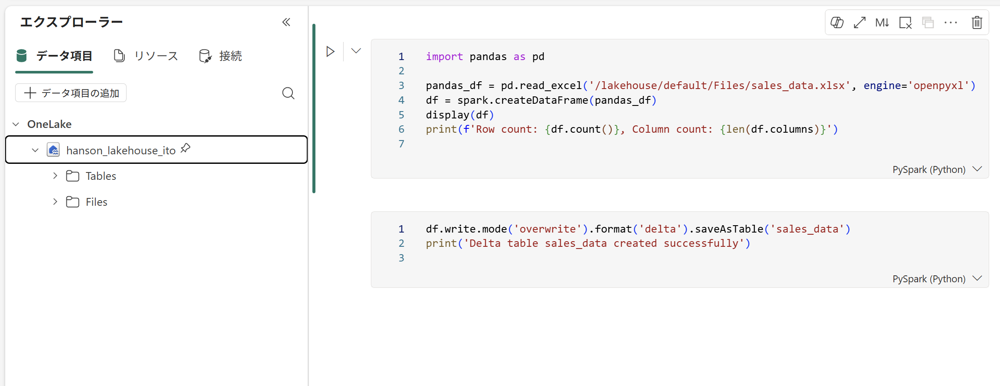
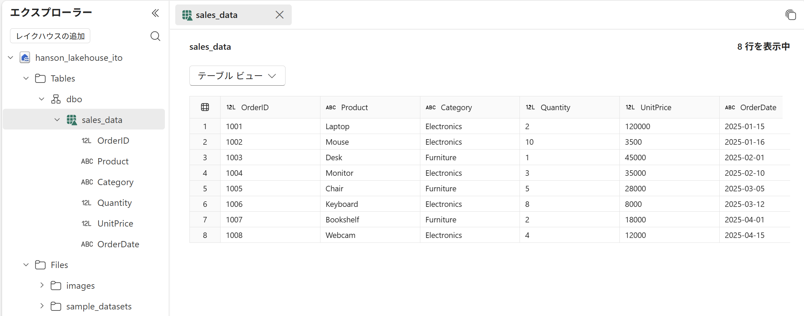

# GitHub Copilot × Microsoft Fabric MCP ハンズオン

**Excel ファイルを Lakehouse の Delta テーブルに変換する — すべて Copilot Chat から実行**

---

## このハンズオンでできること

VS Code の **GitHub Copilot Chat（Agent モード）** に自然言語で指示するだけで、以下の一連のデータエンジニアリング作業を完結させます。

```
Excel ファイル → Fabric Lakehouse にアップロード → Spark で読み込み → Delta テーブル化
```

プログラミングの知識がなくても、チャットに日本語で話しかけるだけで Fabric 上のリソースを操作できます。

---

## はじめに知っておきたい用語

このハンズオンで登場する主な用語を整理します。

### Microsoft Fabric とは？

**Microsoft Fabric** は、データの収集・保存・加工・分析・可視化をひとつのプラットフォームで行えるクラウドサービスです。従来バラバラだったデータ基盤ツールを統合し、すべてのデータを **OneLake** という一元的なストレージで管理します。

### 主要コンポーネント

| 用語 | 説明 | 例え |
|------|------|------|
| **ワークスペース** | プロジェクトごとの作業フォルダ。Lakehouse や Notebook などをまとめて管理する | PC の「フォルダ」に相当 |
| **Lakehouse** | 構造化データ（テーブル）と非構造化データ（ファイル）を両方保存できるストレージ | 「データベース」＋「ファイルサーバー」を合体させたもの |
| **OneLake** | Fabric 全体で共通のストレージ基盤。すべてのデータがここに保存される | Windows の「OneDrive」のデータ版 |
| **Delta テーブル** | データを高速に読み書きできる形式（Delta Lake 形式）で保存されたテーブル | 高速な Excel シートのようなもの |
| **Notebook** | コード（Python / PySpark 等）を対話的に書いて実行できるツール | 「メモ帳」＋「実行ボタン」がついたコードエディタ |
| **Spark** | 大量のデータを並列処理できるエンジン。Notebook 内で自動的に使われる | データ処理の「エンジン」 |
| **キャパシティ** | Fabric の計算リソース（CPU・メモリ）。ワークスペースに割り当てる必要がある | クラウド上の「コンピュータの性能枠」 |

### Lakehouse の構造

```
Lakehouse
├── Files/          ← 生データを置く場所（Excel, CSV, 画像など）
│   └── sales_data.xlsx
├── Tables/         ← Delta テーブルが保存される場所
│   └── dbo/
│       └── sales_data/   ← Notebook で変換後に作られる
└── Functions/      ← ユーザー定義関数（今回は使用しない）
```

### MCP（Model Context Protocol）とは？

**MCP** は、AI アシスタント（GitHub Copilot）が外部のツールやサービスを呼び出すための標準プロトコルです。

通常、Fabric のリソースを操作するには REST API を書いたり、ポータルで手作業する必要がありますが、MCP を使うと **Copilot Chat に自然言語で指示するだけ** で、裏側で自動的に API が呼ばれます。

```
あなたの入力:「Lakehouse を作成してください」
     ↓
GitHub Copilot Chat が MCP Server を呼び出す
     ↓
MCP Server が Fabric REST API を実行
     ↓
Lakehouse が作成される
```

### 3 つの MCP Server の違い

本ハンズオンでは、役割の異なる 3 つの MCP Server を使い分けます。

| MCP Server | 何をするもの？ | 具体的な操作 | いつ使う？ |
|------------|--------------|-------------|-----------|
| **Core MCP Server** | Fabric のリソースを **作る・管理する** | ワークスペース作成、Lakehouse 作成、Notebook 作成 | Step 1, 2 |
| **OneLake MCP Server** | OneLake にファイルを **出し入れする** | ファイルのアップロード、ダウンロード、一覧表示 | Step 3, 5（確認） |
| **Pro-Dev MCP Server** | Notebook を **編集・公開する** | Notebook のローカル作成、Lakehouse 紐付け、パブリッシュ | Step 4 |

> **ポイント**: 3 つの MCP Server は自動的に使い分けられるため、ユーザーがどれを使うか意識する必要はありません。Copilot に自然言語で指示すれば、適切な MCP Server が自動選択されます。

---

## 目次

1. [前提条件](#前提条件)
2. [環境セットアップ](#環境セットアップ)
3. [ハンズオン手順](#ハンズオン手順)
   - [Step 1: ワークスペースの作成](#step-1-ワークスペースの作成)
   - [Step 2: Lakehouse の作成](#step-2-lakehouse-の作成)
   - [Step 3: Excel ファイルのアップロード](#step-3-excel-ファイルのアップロード)
   - [Step 4: Notebook の作成とコード定義](#step-4-notebook-の作成とコード定義)
   - [Step 5: Notebook の実行（テーブル化）](#step-5-notebook-の実行テーブル化)
4. [全体の流れ（アーキテクチャ図）](#全体の流れアーキテクチャ図)
5. [トラブルシューティング](#トラブルシューティング)

---

## 前提条件

| 項目 | 要件 | 補足 |
|------|------|------|
| **VS Code** | 最新版（v1.100 以上推奨） | [ダウンロード](https://code.visualstudio.com/) |
| **GitHub Copilot** | GitHub Copilot Chat 拡張機能 | GitHub の有料プラン、または組織ライセンスが必要 |
| **Microsoft Fabric** | 有効なライセンス（Trial / F2 以上） | [60日間の無料トライアル](https://learn.microsoft.com/fabric/get-started/fabric-trial) が利用可能 |
| **VS Code 拡張機能** | [Microsoft Fabric](https://marketplace.visualstudio.com/items?itemName=Microsoft.microsoft-fabric) | VS Code 拡張機能マーケットプレースからインストール |
| **Azure CLI** | `az login` でサインイン済み | [インストール方法](https://learn.microsoft.com/cli/azure/install-azure-cli) |
| **サンプルデータ** | `sales_data.xlsx` | 本リポジトリの `data/` フォルダに同梱 |

---

## 環境セットアップ

### 1. VS Code 拡張機能のインストール

VS Code の拡張機能マーケットプレース（`Ctrl + Shift + X`）から、以下を検索してインストールします：

- **GitHub Copilot** — AI コード補完
- **GitHub Copilot Chat** — AI チャット（Agent モード対応）
- **Microsoft Fabric** — Fabric 連携（Notebook 編集・MCP Server を含む）

### 2. MCP の有効化

VS Code の設定ファイル（`Ctrl + ,` → 検索で「mcp」と入力）で以下を有効にします：

```jsonc
{
  "github.copilot.chat.mcp.enabled": true
}
```

> この設定により、Copilot Chat が Fabric MCP Server を認識し、チャットから Fabric 操作が可能になります。

### 3. 認証の設定（3 箇所）

Fabric MCP を使うには、以下の **3 つの認証** をすべて完了する必要があります。

| # | 認証先 | 方法 | 用途 |
|---|--------|------|------|
| ① | **Azure CLI** | ターミナルで `az login` を実行 | OneLake MCP Server のファイル操作 |
| ② | **VS Code Azure 拡張機能** | Copilot Chat で認証ウィザードが自動起動 | Core MCP Server のリソース作成 |
| ③ | **Fabric Notebook 拡張機能** | VS Code 左サイドバーの Fabric アイコンからサインイン | Pro-Dev MCP Server の Notebook 操作 |

```bash
# ① Azure CLI でサインイン
az login
```

> **注意**: 認証が不足していると `UserNotLicensed` や `No active workspace` などのエラーが発生します。

### 4. サンプル Excel ファイルの準備

本リポジトリに同梱の [data/sales_data.xlsx](./data/sales_data.xlsx) を使用します。

自分で作成する場合は、以下のデータ構造で Excel ファイルを用意してください：

| OrderID | Product    | Category      | Quantity | UnitPrice | OrderDate  |
|---------|------------|---------------|----------|-----------|------------|
| 1001    | Laptop     | Electronics   | 2        | 120000    | 2025-01-15 |
| 1002    | Mouse      | Electronics   | 10       | 3500      | 2025-01-16 |
| 1003    | Desk       | Furniture     | 1        | 45000     | 2025-02-01 |
| 1004    | Monitor    | Electronics   | 3        | 35000     | 2025-02-10 |
| 1005    | Chair      | Furniture     | 5        | 28000     | 2025-03-05 |
| 1006    | Keyboard   | Electronics   | 8        | 8000      | 2025-03-12 |
| 1007    | Bookshelf  | Furniture     | 2        | 18000     | 2025-04-01 |
| 1008    | Webcam     | Electronics   | 4        | 12000     | 2025-04-15 |

> Python がインストール済みなら、`pip install openpyxl` の後に `python data/create_sample_excel.py` でも作成できます。

---

## ハンズオン手順

以下の手順は、すべて **VS Code の GitHub Copilot Chat** で実行します。  
`Ctrl + Shift + I` で Agent モードを開き、チャット欄にプロンプトを入力してください。

> **Agent モードとは？**  
> Copilot Chat が MCP Server やターミナルなどの外部ツールを呼び出せるモードです。通常のチャットモードでは MCP Server は使えません。

---

### Step 1: ワークスペースの作成

> **使用 MCP Server**: Core MCP Server  
> **何が起きる？**: Fabric 上にプロジェクト用のフォルダ（ワークスペース）が作られます

Copilot Chat に以下のように入力します：

```
Fabricに「handson-workspace」というワークスペースを作成してください
```

Copilot が裏側で `mcp_fabric_mcp_core_create-item` ツールを呼び出し、ワークスペースが作成されます。

**確認**: Copilot の応答にワークスペース ID が表示されれば成功です。

> **注意**: 作成後、Fabric ポータル (https://app.fabric.microsoft.com) でワークスペースに **キャパシティ（Trial 等）が割り当てられている** ことを確認してください。キャパシティがないと、以降の操作が `FeatureNotAvailable` エラーになります。

#### Fabric ポータルでの確認

ワークスペースを開くと、作成したアイテム（Lakehouse・Notebook 等）が一覧表示されます：



> 上の画面では `excel_to_delta`（ノートブック）と `hanson_lakehouse_ito`（レイクハウス）が作成されていることが確認できます。

---

### Step 2: Lakehouse の作成

> **使用 MCP Server**: Core MCP Server  
> **何が起きる？**: ワークスペース内にデータ保存用の Lakehouse が作られます

```
「handson-workspace」ワークスペースに「handson_lakehouse」という Lakehouse を作成してください
```

**確認**: Lakehouse ID が返されれば成功です。

> **注意**: **Lakehouse 名にハイフン (`-`) は使えません。** アンダースコア (`_`) を使ってください。
>
> ```
> [NG] HandsOn-Lakehouse   → エラー
> HandsOn_Lakehouse   → OK
> ```

---

### Step 3: Excel ファイルのアップロード

> **使用 MCP Server**: OneLake MCP Server  
> **何が起きる？**: ローカルの Excel ファイルが Lakehouse の `Files/` フォルダにアップロードされます

```
ローカルの data/sales_data.xlsx を
「handson-workspace」の「handson_lakehouse」の Files 領域にアップロードしてください
```

**確認**: アップロード後、以下のプロンプトでファイルが存在するか確認できます。

```
「handson_lakehouse」の Files フォルダの内容を表示してください
```

`sales_data.xlsx` が一覧に表示されれば成功です。

#### Fabric ポータルでの確認

Lakehouse を開き、左ペインの **Files** を展開すると、アップロードした Excel ファイルが確認できます：



> `sales_data.xlsx`（5 KB）が Files フォルダに保存されていることが確認できます。

---

### Step 4: Notebook の作成とコード定義

> **使用 MCP Server**: Pro-Dev MCP Server（Fabric Notebook 拡張機能）  
> **何が起きる？**: Fabric 上に Notebook が作られ、Excel を読み込んで Delta テーブルに変換するコードが書き込まれます

#### 4-1. Notebook の作成

```
Fabric に「excel_to_delta」という名前の Notebook を作成してください
```

Notebook が Fabric ワークスペースに作成され、ローカルにもダウンロードされます。

#### 4-2. デフォルト Lakehouse の設定

Notebook がどの Lakehouse のデータを操作するかを紐付けます。

```
Notebook「excel_to_delta」のデフォルト Lakehouse を「handson_lakehouse」に設定してください
```

> **デフォルト Lakehouse とは？**  
> Notebook 内のコードで `/lakehouse/default/` というパスを使うと、ここで紐付けた Lakehouse を参照します。

#### 4-3. コードの生成

Copilot にデータ変換コードを書いてもらいます：

```
この Notebook に、以下の処理を行う PySpark コードを書いてください：
1. Lakehouse の Files/sales_data.xlsx を pandas で読み込む
2. Spark DataFrame に変換して表示する
3. Delta テーブル「sales_data」として保存する
```

Copilot が生成するコード例：

**セル 1: Excel を読み込んで表示**
```python
import pandas as pd

# Excel ファイルを pandas で読み込み → Spark DataFrame に変換
pandas_df = pd.read_excel("/lakehouse/default/Files/sales_data.xlsx", engine="openpyxl")
df = spark.createDataFrame(pandas_df)

# データの内容を確認
display(df)
print(f"Row count: {df.count()}, Column count: {len(df.columns)}")
```

**セル 2: Delta テーブルとして保存**
```python
# Lakehouse の Tables 領域に Delta テーブルとして保存
df.write.mode("overwrite").format("delta").saveAsTable("sales_data")
print("Delta table 'sales_data' created successfully")
```

#### 4-4. Notebook のパブリッシュ

ローカルで編集した Notebook を Fabric ワークスペースに反映（パブリッシュ）します。

```
Notebook「excel_to_delta」をパブリッシュしてください
```

> **パブリッシュとは？**  
> ローカルで編集した Notebook の内容を、Fabric クラウド上の Notebook に同期する操作です。パブリッシュしないと、ローカルの変更はクラウドに反映されません。

#### Fabric ポータルでの確認

Notebook を開くと、Copilot が生成したコードと、左パネルにデフォルト Lakehouse が紐付いていることが確認できます：



> 左パネルの「OneLake」セクションに `hanson_lakehouse_ito` が表示され、Notebook とLakehouse が紐付いていることが分かります。

---

### Step 5: Notebook の実行（テーブル化）

> **何が起きる？**: Notebook 内のコードが Spark エンジンで実行され、Excel データが Delta テーブルに変換されます

実行方法は 3 つあります。

#### 方法 A: Fabric ポータルから実行（初心者向け・推奨）

1. [Microsoft Fabric ポータル](https://app.fabric.microsoft.com/) をブラウザで開く
2. ワークスペースを選択
3. Notebook `excel_to_delta` を開く
4. 画面上部の **「すべて実行」** ボタンをクリック

#### 方法 B: Copilot Chat から REST API で実行

```
Fabric REST API で Notebook「excel_to_delta」を実行してください
```

Copilot が Fabric REST API（Jobs API）を呼び出して Notebook を実行します。  
Spark クラスタの起動に数分かかるため、完了まで待つ必要があります。

#### 方法 C: VS Code から直接実行

VS Code でダウンロードした Notebook を開き、セルの ▶ ボタンで直接実行します。  
※ Fabric のリモートコンピュートに接続されている必要があります。

---

### 完了確認

実行後、以下のプロンプトで Delta テーブルが作成されたか確認します：

```
「handson_lakehouse」の Tables フォルダの内容を表示してください
```

`Tables/dbo/sales_data` ディレクトリが表示されれば **ハンズオン完了** です。
#### Fabric ポータルでの確認

Lakehouse の Tables を開くと、Delta テーブルの中身をプレビューできます：



> Excel のデータ（8行 × 6列）が Delta テーブル `sales_data` として正しく変換されていることが確認できます。各カラムの型（12L = 数値, ABC = 文字列）も自動推定されています。
```
Lakehouse
├── Files/
│   └── sales_data.xlsx       ← アップロードした元データ
└── Tables/
    └── dbo/
        └── sales_data/       ← Notebook で作成された Delta テーブル
            ├── _delta_log/
            └── part-00000-xxx.parquet  (複数ファイル)
```

---

## 全体の流れ（アーキテクチャ図）

```
┌─────────────────────────────────────────────────────────────┐
│           あなた（VS Code の Copilot Chat に入力）             │
│                                                             │
│  「Lakehouse を作成して」「Excel をアップロードして」etc.      │
└──────────┬────────────┬────────────┬────────────────────────┘
           │            │            │
     ┌─────▼──────┐ ┌───▼────────┐ ┌─▼──────────────────────┐
     │ Core MCP   │ │ OneLake    │ │ Pro-Dev MCP            │
     │ Server     │ │ MCP Server │ │ Server                 │
     │            │ │            │ │ (Fabric Notebook 拡張)  │
     │ リソースを  │ │ ファイルを  │ │                        │
     │ 作る・管理  │ │ 出し入れ   │ │ Notebook を            │
     │            │ │            │ │ 編集・公開             │
     │ Step 1, 2  │ │ Step 3, 5  │ │ Step 4                 │
     └─────┬──────┘ └───┬────────┘ └─┬──────────────────────┘
           │            │            │
     ┌─────▼────────────▼────────────▼───────────────────────┐
     │              Microsoft Fabric Platform                 │
     │                                                        │
     │  ┌──────────────────────────────────────────────┐      │
     │  │ ワークスペース                                 │      │
     │  │  ┌────────────────────────────┐               │      │
     │  │  │ Lakehouse                  │               │      │
     │  │  │  Files/ → Tables/ (Delta)  │               │      │
     │  │  └────────────────────────────┘               │      │
     │  │  ┌────────────────────────────┐               │      │
     │  │  │ Notebook (Spark で実行)     │               │      │
     │  │  └────────────────────────────┘               │      │
     │  └──────────────────────────────────────────────┘      │
     └────────────────────────────────────────────────────────┘
```

### 使用する MCP ツール一覧

| Step | 操作 | MCP Server | ツール |
|------|------|------------|--------|
| 1 | ワークスペース作成 | Core | `mcp_fabric_mcp_core_create-item` |
| 2 | Lakehouse 作成 | Core | `mcp_fabric_mcp_core_create-item` |
| 3 | Excel アップロード | OneLake | `mcp_fabric_mcp_onelake_upload_file` |
| 3 | ファイル一覧確認 | OneLake | `mcp_fabric_mcp_onelake_list_files` |
| 4 | Notebook 作成 | Pro-Dev | `fabric_notebookCreateTool` |
| 4 | Lakehouse 紐付け | Pro-Dev | `fabric_setDefaultLakehouseTool` |
| 4 | パブリッシュ | Pro-Dev | `fabric_notebookPublishTool` |
| 5 | Notebook 実行 | REST API | Jobs API (`RunNotebook`) |
| 5 | テーブル確認 | OneLake | `mcp_fabric_mcp_onelake_list_files` |

---

## トラブルシューティング

### MCP ツールが認識されない

**原因**: MCP が無効、または Fabric 拡張機能が未インストール

**解決方法**:
1. VS Code 設定で `"github.copilot.chat.mcp.enabled": true` を確認
2. Microsoft Fabric 拡張機能が最新版かチェック
3. VS Code を再起動

### `UserNotLicensed` エラー

**原因**: VS Code の Azure 拡張機能で Fabric ライセンスが認証できていない

**解決方法**:
1. Copilot Chat に「Azure の認証を設定してください」と依頼して認証ウィザードを実行
2. Fabric ライセンス（Trial / F2 以上）がアカウントに割り当てられているか [Fabric ポータル](https://app.fabric.microsoft.com/) で確認

### `FeatureNotAvailable` エラー

**原因**: ワークスペースに Fabric キャパシティが割り当てられていない

**解決方法**:
1. Fabric ポータルでワークスペースを開く
2. 設定 → ライセンス → Trial または Fabric キャパシティを割り当て

### Lakehouse 名でエラーが出る

**原因**: Lakehouse 名にハイフン (`-`) が含まれている

**解決方法**: アンダースコア (`_`) を使用
```
[NG] HandsOn-Lakehouse
HandsOn_Lakehouse
```

### Notebook 作成で「No active workspace」

**原因**: Fabric Notebook 拡張機能でワークスペースが選択されていない

**解決方法**:
1. VS Code 左サイドバーの **Fabric アイコン** をクリック
2. ワークスペースをクリックして選択
3. 再度 Notebook 作成を実行

### Excel 読み込みでエラー

**原因**: `spark.read.format("com.crealytics.spark.excel")` はサードパーティ製ライブラリであり、Fabric の Spark ランタイムにはデフォルトでインストールされていない

**解決方法**: Fabric には `openpyxl` が標準搭載されているため、`pandas` 経由で読み込むのが最も簡単です（本ハンズオンではこの方法を採用）。

```python
import pandas as pd
pandas_df = pd.read_excel("/lakehouse/default/Files/sales_data.xlsx", engine="openpyxl")
df = spark.createDataFrame(pandas_df)
```

> Spark Excel コネクタを使いたい場合は、Fabric の Environment にカスタムライブラリとして `com.crealytics:spark-excel` を追加してください。

### Notebook 実行が `Failed` になる

**原因**: Notebook の定義フォーマットが正しくない、またはデフォルト Lakehouse が未設定

**解決方法**:
1. Fabric ポータルで Notebook を開き、左パネルで Lakehouse が紐付いているか確認
2. Lakehouse が紐付いていない場合は手動で追加
3. ポータルから「すべて実行」で再試行

---

## 発展: SharePoint Online のファイルをショートカットで取り込む

本ハンズオンでは Excel ファイルをローカルからアップロードしましたが、実際の業務では **SharePoint Online (SPO) 上のファイルを直接 Lakehouse で参照したい** ケースが多くあります。

Fabric の **OneLake ショートカット** は SharePoint Online / OneDrive for Business に対応しており、ファイルをコピーせずに Lakehouse から直接アクセスできます。

### ショートカットの仕組み

```
SharePoint Online                        Lakehouse
┌─────────────────────┐                 ┌──────────────────────────┐
│ チームサイト          │                 │ Files/                   │
│  └─ Documents/      │  ショートカット   │  └─ spo_sales/ (shortcut)│
│      └─ sales.xlsx  │ ──────────────> │      └─ sales.xlsx       │
└─────────────────────┘  データコピー不要  └──────────────────────────┘
```

- データはコピーされず、SPO 上の最新データを常に参照
- SPO 側でファイルが更新されれば、Lakehouse からも即座に最新版が見える
- ショートカットは Fabric ポータルの GUI または REST API から作成可能

### ショートカットの作成手順

1. Fabric ポータルで Lakehouse を開く
2. エクスプローラーの **Files** を右クリック → **新しいショートカット**
3. 外部ソースから **OneDrive and SharePoint** を選択
4. SharePoint サイトの URL を入力して接続
5. 対象フォルダを選択 → **作成**

> 参考: [OneDrive and SharePoint ショートカットの作成](https://learn.microsoft.com/fabric/onelake/shortcuts/create-onedrive-sharepoint-shortcut)

### Notebook からの読み込み

ショートカット作成後、Notebook からは通常のファイルと同様にアクセスできます。

```python
import pandas as pd

# ショートカット経由で SPO 上の Excel を直接読み込み
pandas_df = pd.read_excel("/lakehouse/default/Files/spo_sales/sales_data.xlsx", engine="openpyxl")
df = spark.createDataFrame(pandas_df)
display(df)
```

### 業務シナリオ例

この仕組みを活用すると、以下のような業務シナリオを実現できます。

#### シナリオ 1: 営業日報の自動集計

```
営業担当者が SPO に日報 Excel をアップロード
     ↓ (ショートカットで Lakehouse に自動連携)
Notebook が定期実行され、全日報を集計して Delta テーブル化
     ↓
Power BI ダッシュボードで営業実績をリアルタイム可視化
```

- 営業担当者は従来通り SharePoint にファイルを置くだけ
- データ基盤チームの手作業（ファイル回収・加工）が不要に

#### シナリオ 2: 経理部門の月次レポート作成

```
各部門が SPO 上の共有フォルダに経費 Excel を格納
     ↓ (ショートカット)
Notebook で全部門の経費データを統合・クレンジング
     ↓
Delta テーブル → SQL エンドポイントで経理システムから参照
```

- 部門ごとにバラバラだった Excel をひとつの Delta テーブルに統合
- SQL エンドポイント経由で既存の経理システムからも参照可能

#### シナリオ 3: 店舗別売上データの統合分析

```
各店舗が SPO の店舗フォルダに売上 Excel を週次更新
     ↓ (ショートカット)
Notebook で全店舗データを結合 → Delta テーブル
     ↓
Power BI で店舗比較・トレンド分析
```

- 100 店舗分の Excel を手作業で集めて加工する必要がなくなる
- SPO のファイル更新がそのまま分析に反映

### 本ハンズオンとの組み合わせ

本ハンズオンの Step 3（Excel アップロード）をショートカットに置き換えるだけで、SPO 連携シナリオに発展できます。

| Step | 本ハンズオン | SPO 連携版 |
|------|------------|-----------|
| 1 | ワークスペース作成 | 同じ |
| 2 | Lakehouse 作成 | 同じ |
| **3** | **ローカルから Excel アップロード** | **SPO へのショートカット作成** |
| 4 | Notebook 作成・コード定義 | パスを変更するだけ |
| 5 | Notebook 実行 | 同じ |

---

## 発展: 作成した Delta テーブルの活用

ハンズオンで作成した Delta テーブル `sales_data` は、Fabric の各サービスからそのまま利用できます。

### 活用方法

| 活用先 | 接続方法 | 用途 |
|--------|----------|------|
| **Power BI** | DirectLake モードで直接接続 | ダッシュボード・レポート作成。データのインポートが不要で高速 |
| **SQL エンドポイント** | Lakehouse に自動生成される SQL エンドポイント | T-SQL でクエリ可能。Fabric ポータルの SQL エディタや ODBC/JDBC 対応ツールから接続 |
| **別の Notebook** | `spark.sql("SELECT * FROM sales_data")` | さらなるデータ加工、機械学習モデルの学習データとして利用 |
| **Data Pipeline** | Copy Activity やデータフローで参照 | 定期的な ETL 処理に組み込み |
| **他の Lakehouse / Warehouse** | ショートカットまたはクロスクエリ | 他チームのワークスペースから参照（データメッシュ） |
| **外部ツール** | SQL エンドポイント経由（ODBC / JDBC） | 既存の業務システムや BI ツールからアクセス |

### SQL エンドポイントの自動生成

Lakehouse を作成すると **SQL 分析エンドポイント** が自動的に生成されます。Spark を知らないユーザーでも、以下のような T-SQL でデータを参照できます。

```sql
-- カテゴリ別の売上合計
SELECT
    Category,
    SUM(CAST(Quantity AS INT) * CAST(UnitPrice AS INT)) AS TotalSales,
    COUNT(*) AS OrderCount
FROM sales_data
GROUP BY Category
ORDER BY TotalSales DESC;
```

### Power BI との連携

Lakehouse の Delta テーブルは **DirectLake モード** で Power BI に接続できます。従来の Import モードや DirectQuery モードと異なり、データのコピーやゲートウェイが不要で、Delta テーブルを直接クエリします。

```
Delta テーブル: sales_data
     │
     ├─→ Power BI ダッシュボード（DirectLake で直接接続）
     ├─→ SQL クエリ（SQL エンドポイント経由）
     ├─→ 別の Notebook（追加の分析・ML）
     └─→ 他チームのワークスペース（ショートカットで参照）
```

### 本ハンズオンからの次のステップ

| やりたいこと | 方法 |
|-------------|------|
| 売上ダッシュボードを作りたい | Power BI Desktop で Lakehouse に接続 → DirectLake レポートを作成 |
| 定期的にデータを更新したい | Data Pipeline で Notebook をスケジュール実行 |
| データの品質をチェックしたい | Notebook で統計情報を出力、または Data Quality ルールを設定 |
| 他部門にデータを共有したい | ワークスペースのアクセス権を付与、または他 Lakehouse からショートカットで参照 |

---

## 参考リンク

| リンク | 説明 |
|--------|------|
| [Microsoft Fabric ドキュメント](https://learn.microsoft.com/fabric/) | Fabric 全体の公式ドキュメント |
| [Fabric 無料トライアル](https://learn.microsoft.com/fabric/get-started/fabric-trial) | 60 日間の無料体験の開始方法 |
| [GitHub Copilot ドキュメント](https://docs.github.com/copilot) | Copilot の機能と使い方 |
| [Fabric REST API](https://learn.microsoft.com/rest/api/fabric/) | API リファレンス |
| [OneLake API](https://learn.microsoft.com/fabric/onelake/) | OneLake ストレージの API |
| [OneLake ショートカット](https://learn.microsoft.com/fabric/onelake/onelake-shortcuts) | ショートカットの概要と対応ソース |
| [SPO ショートカットの作成](https://learn.microsoft.com/fabric/onelake/shortcuts/create-onedrive-sharepoint-shortcut) | SharePoint / OneDrive ショートカットの手順 |

---

## 免責事項

本コンテンツは情報提供および学習目的で作成されたものであり、内容の正確性や完全性を保証するものではありません。本ハンズオンの手順や記載内容を参考にして行った操作・設定等により生じたいかなる損害についても、作成者は一切の責任を負いません。実際の業務環境への適用にあたっては、ご自身の責任において十分な検証を行ってください。

また、Microsoft Fabric、GitHub Copilot 等の各サービスの仕様・機能・画面は予告なく変更される場合があります。最新の情報は各サービスの公式ドキュメントをご参照ください。

---

## ライセンス

MIT License
